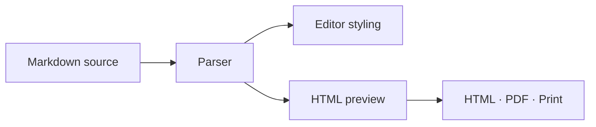
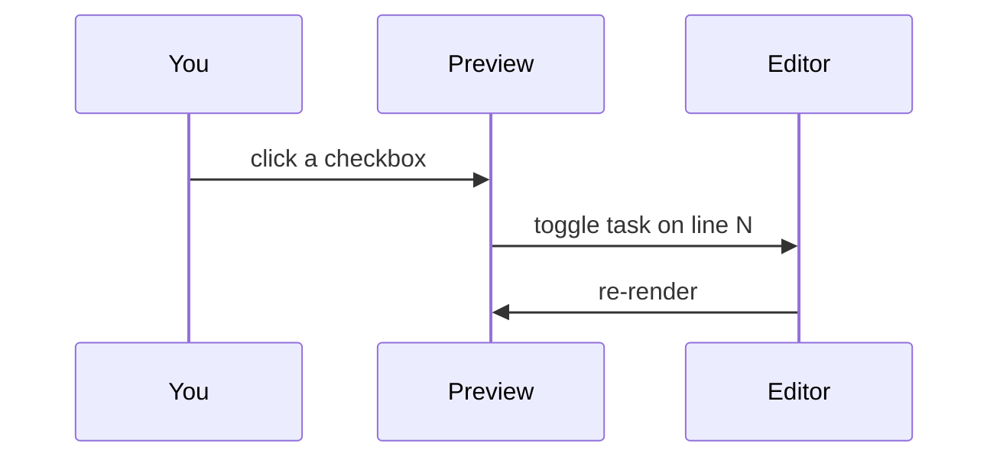

# Math, diagrams and tasks

## Math

Inline math sits in dollars: the area of a circle is $\pi r^2$, and
$e^{i\pi} + 1 = 0$. Prices like $5 and $10 stay plain text.

Display math goes between double dollars:

$$
\int_0^\infty e^{-x^2}\,dx = \frac{\sqrt{\pi}}{2}
$$

or in a `math` code block:

```math
\begin{aligned}
  \nabla \cdot \mathbf{E} &= \frac{\rho}{\varepsilon_0} \\
  \nabla \cdot \mathbf{B} &= 0
\end{aligned}
```

## Diagrams





## Tasks

Click the boxes in the preview — the source changes with them.

- [x] Write the parser
- [ ] Try focus mode (⇧⌘F)
- [ ] Try typewriter scrolling (⌥⌘Y)
- [ ] Paste a screenshot into a saved document
